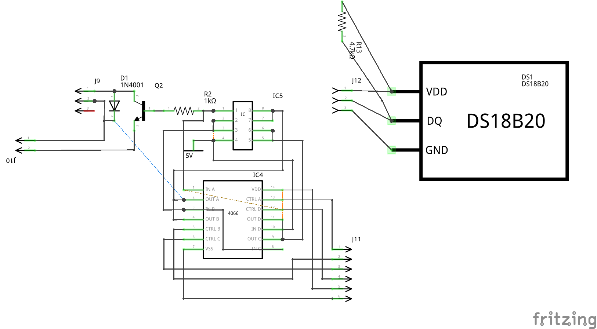

# Hardware description
Hardware includes :
- A UC Card (Arduino)
- A shield to drive the fan
- A shield to support D1 ESP8266
- A shield for relay
 
## UC Card
UC Card is a simple Arduino barebone with 7805 regulator, as powered by 12V
### list of I/O used
| Sensor/Output | Arduino pin |
| --- | --- |
| DS1820 (temperature) | D4 |
| Display TM1637 | D2 (CLK), D3(DIO) |
| Current sensor (ACS711) | A0 |
| Fan speed | D9, D10, D11, D12 |
| Relays (backup of ESP8266) | D5, D6, D7, D8 |

### schema

### board

### list of headers
| header | function |
| --- | --- |
| J1 | connect to USB converter to upload program in ATMega |
| J2 | undirect to DS1820  temp sensor |
| J3 | GND and +5V for external purpose |
| J4 | current sensor |
| J5 | Relays |
| J6 | Fan speed (to fan shield) |
| J7 | GND and +12V for Fan shield |
| J8 | Display |

## Fan shield
PNP transistor drives the fan. Resistor between base of the transistor and Vcc can be changed ; use a 4066 quad switch and resistors are put on a IC socket, so they can be changed easily depending on the fan used and the speeds desired. 4066 switches are controled by the UC (pins D9 to D12).
This card is also supporting the DS1820 temp sensor.
### schema
 
### card
 
### list of headers
| header | function |
| --- | --- |
| J9 | fan connector |
| J10 | GND and 12V (for the fan) |
| J11 |  to UC Card |
| J12 |  to DS1820 temp sensor |

## D1 shield
## Relay shield

## Switches
Use of ON-OFF-ON switched to allow each output to be OFF, ON or drived by the ESP8266. I use this type of switch:
 

4 of them are required, 1 of the outputs is always on.
## Power
Power used is a 60W Meanwell switching power (model T60, currently discontinued, but could be replaced by more recent one). Ouputs : 5V/5A, +12V/2.5A and -12V (noy used).
** Warning : this device is connected to main power. Be very carefull with it. To avoid electric choc, plastic enclosure must be used. Never plug to main power when the enclosure is open. Don't do this project if your are not familiar with this type of electric part. Check isolation. Never touch the power when connected to main power. Use fuse between this device and the main power **